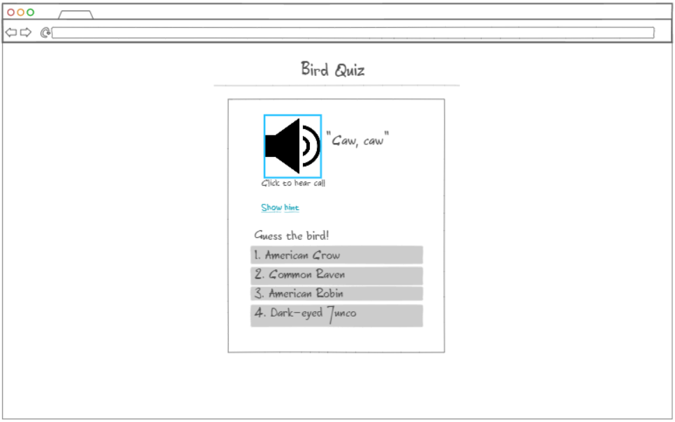

# Bird Quiz

## Description deliverable

### Elevator pitch

People are always impressed when I can accurately identify birds simply by listening to their calls, and nothing else. It seems like a strange, difficult task to learn this skill, but in reality, anyone can with a bit of practice. That's where my website comes in. When a user enters the website and logs in, they can practice learning the most common bird calls from their region with a quiz that has a flashcard-like structure. Progress is saved to their account, so they can pick up where they left off and see their skills improve.  

### Design

Here is a mock up of what the bird quiz UI will look like.

### Key features

- Secure login of HTTPS
- Ability to do multiple-choice style quiz of birds based in different regions
- "Show hint" will reveal an image of the current bird
- Display of four bird names as possible answers
- Test history is stored for each user
- Compare quiz results with other users for the same region

### Technologies

I am going to use the required technologies in the following ways.

- **Authentication** - Includes login page to create account or log back in to existing account. Account name is displayed on login page.
- **Database data** - Users' past quizzes and scores will be stored in database.
- **WebSocket data** - Other users results for tests in the same region will be displayed in real time

### HTML Deliverable

For this deliverable I built out the structure of my application using HTML.

- Simon HTML is deployed to my production environment (simon.birdquiz.click)
- A link to my GitHub startup respository is in the footer of each page of startup.birdquiz.click
- Four different interlinking HTML webpages with appropriate textual content
- Placeholder for 3rd party service calls are found on the learn page, in the form of a recording
- There are two images on the My Journey page and one image on the home page
- There is a login placeholder on the home page and a placeholder for username in the header of every other page.
- There are placeholders on the My Journey page for content that will be stored in the database (user's quiz scores), and where realtime communication will go (other users' quiz scores), represented by graph images
- There are several Git commits with adequate comments

### CSS Deliverable

- For this deliverable I properly styled the application into its final appearance.

- Simon CSS is deployed to my production environment (simon.birdquiz.click)
- A link to my GitHub startup repository is in the footer of each page of startup.birdquiz.click
- Header, footer, and main content body fully styled with CSS
- Navigation elements were updated, "Learn" became a button, colors were changed and underline is gone
- @media controls are implemented in CSS to hide header/footer when the screen size gets too small
- Application elements are present in the form of cards, buttons, and an audio player
- Text content on every page
- Images are present on every page but learn.html 
- There are several Git commits with adquate comments

### JavaScript Deliverable

For this deliverable I implemented by JavaScript so that the application works for a single user. I also added placeholders for future technology.
- login - When you press enter or the login button it takes you to the myJourney page, and username and password are stored.
- database - Displayed user's past score on myJourney. Username is displayed in header. Currently these are stored and retrieved from local storage, but it will be replaced with the database data later.
- WebSocket - A representation of other user's scores is found on the myJourney page. This will be replaced with WebSocket messages later.
- application logic - Quiz fully implemented on the learn page
- There are several Git commits with adquate comments

### Service Deliverable

For this deliverable I added backend endpoints that makes users' scores visible to all, and called to an external API to generate scientific names.
- Node.js/Express HTTP service - done!
- Static middleware for frontend - done!
- Calls to third party endpoints - Each scientific name on the "learn" page is generated by a call to "Nuthatch API"
- Backend service endpoints - Scores are posted on "learn" page when a quiz is completed
- Frontend calls service endpoints - Scores are gotten on the "MyJourney" page when opened
- There are multiple Git commits with meaningful comments

## DB deliverable

For this deliverable I stored scoresin the database.
- **MongoDB Atlas database created** - done!
- **Endpoints for data** - My stubbed out endpoints now process the data and send it to Mongo.
- **Stores data in MongoDB** - done!
- There are Git commits with meaningful comments
